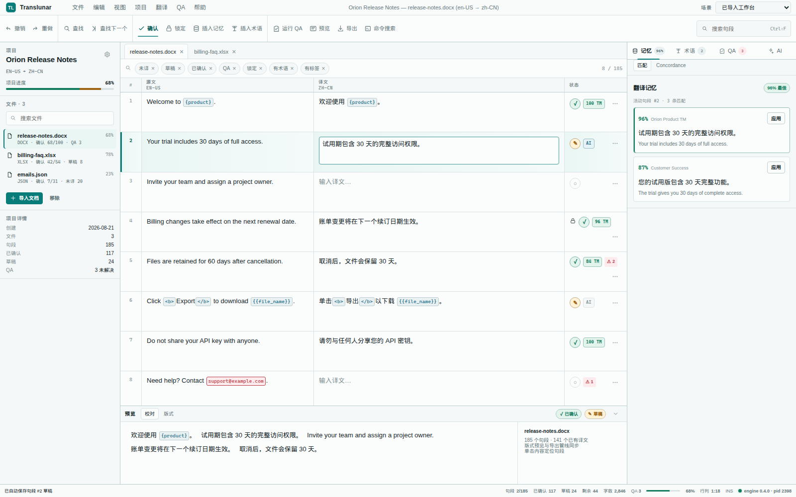
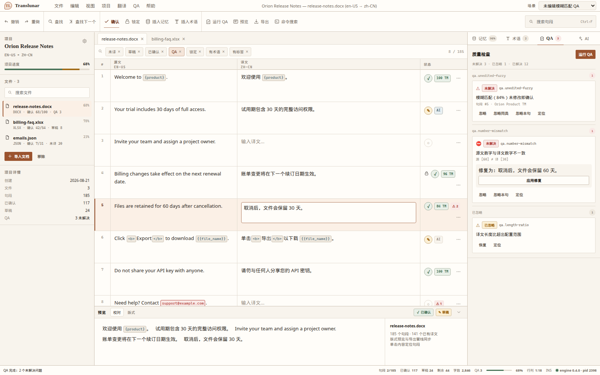
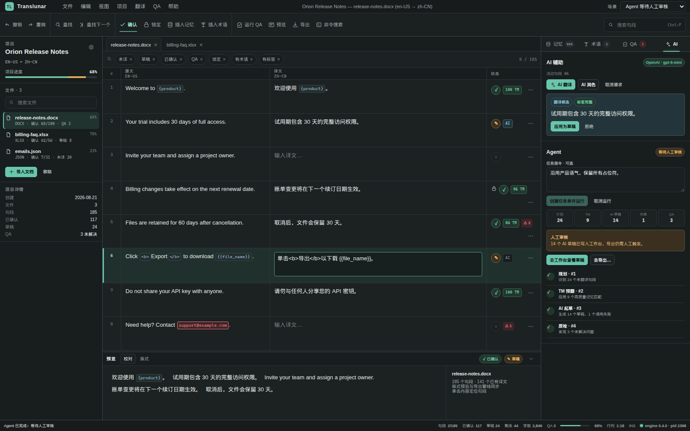

# Translunar CAT Workbench — Modern SaaS studies

Three full-fidelity visual systems share one interaction model and the complete Workbench IA.

## Open

- [Tide](./saas-gpt-tide/index.html)
- [Ochre](./saas-gpt-ochre/index.html)
- [Carbon](./saas-gpt-carbon/index.html)
- [Feature inventory](./FEATURE-INVENTORY.md)

Each study accepts `?scene=<id>`:

| Scene | State |
| --- | --- |
| `empty` | Empty project list and project creation |
| `imported` | Imported document grid |
| `confirmed` | Confirmed segment written to TM |
| `locked` | Locked row |
| `fuzzy` | Unedited-fuzzy QA |
| `unconfigured` | AI provider unconfigured |
| `agent` | Agent awaiting human review |
| `exportGate` | QA export gate |

The in-product 场景 selector exposes the same states.

## Shared functional coverage

- Seven application menus and twelve verb-first ribbon commands.
- Project explorer, file search, per-document progress, document tabs, all requested filter chips.
- Editable bilingual grid with state, lock, provenance, QA, tokens, row menu, confirm modes, find/replace.
- Memory plus concordance, terminology, QA fixes and waivers, AI Assist plus Agent.
- Proofread and layout preview with click-to-jump.
- Command palette with commands, docks, documents, and help entries.
- Project creation, import/SRX, project settings, TM manager, term manager, overwrite, QA export, and engine gates.
- Progress, word count, draft/QA jumps, caret, insert mode, and engine status.

## Design reads

### Tide

Operational calm for long translation sessions. Cool mineral neutrals, a restrained teal action color, four-pixel controls, compact sans typography, and a lightly tinted active row keep the grid dominant. State colors retain low surface area while the selected translation remains easy to track from grid to preview to dock.

Best fit: teams prioritizing familiarity, scan speed, and low visual fatigue.

### Ochre

Warm editorial precision. Paper-toned surfaces, fine brown separators, squared controls, serif display labels, and measured vertical breathing room give language content a document-oriented character. Functional density remains at parity with Tide; provenance, QA, and commands use the same positions.

Best fit: localization teams working heavily with publication, legal, and editorial material.

### Carbon

High-focus dark workbench. Near-black layered surfaces, mint interaction cues, compact rows, and brighter semantic foregrounds support extended use in low-light environments. The active target editor and human-review gate form the strongest visual anchors.

Best fit: expert translators who prefer dense dark tools and keyboard-led review.

## Interaction notes

- `Ctrl+K`: command palette.
- `Ctrl+F` / `Ctrl+H`: find / replace.
- `Ctrl+Enter`: confirm active segment and report TM write.
- `F4` / `Shift+F4`: next / previous result.
- Ribbon, menus, dock tabs, row menus, filters, preview modes, file search, settings switches, scenarios, and all dialogs are interactive.

